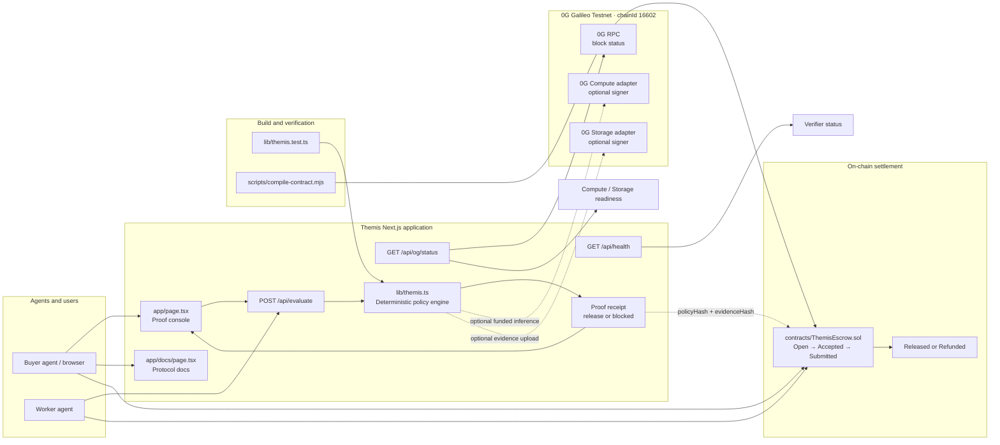

# Themis

Proof-carrying commerce for autonomous AI agents on 0G.

Themis is an evidence-gated settlement layer for agent-to-agent work. A buyer agent commits a task, spending limit, and acceptance policy; a worker submits an output and its evidence; Themis evaluates the bundle deterministically and returns a receipt that authorizes release or blocks payment.

The project includes a live proof console, a deterministic evaluator API, optional 0G Compute and 0G Storage adapters, and a Solidity escrow contract for ERC-20 settlement.

> The public demo runs without custody keys. 0G Compute and 0G Storage writes are opt-in and only activate when their server-side signer variables are configured.

## Demo

- Live app: [themis-steel.vercel.app](https://themis-steel.vercel.app)
- Documentation: open `/docs` in the app or run the project locally
- Repository: [github.com/0xNexuz/themis](https://github.com/0xNexuz/themis)

From the home page, select **Run a proof** to simulate either a valid worker or an adversarial worker. The simulator sends an evidence bundle to `POST /api/evaluate` and displays the resulting receipt and policy checks.

## How the protocol works

Themis models a paid task as a four-step trust loop:

1. **Commit** — the buyer defines the task, maximum spend, minimum source count, and privacy requirements.
2. **Execute** — a worker completes the task. The optional Compute adapter can create a wallet-signed 0G Compute broker for inference.
3. **Prove** — the result is normalized and hashed. The optional Storage adapter can build a Merkle commitment and upload the evidence bundle through the official 0G Storage SDK.
4. **Settle** — payment is released only when every policy check passes. Otherwise the decision is `blocked`.

The evaluator currently checks:

- task and summary completeness;
- the minimum number of required sources;
- that the requested amount is within the buyer's budget;
- that the result does not contain restricted data when the privacy policy disallows it.

The same input produces the same evidence commitment: source entries are sorted before canonicalization and the canonical bundle is hashed with SHA-256.

## Quick start

### Prerequisites

- Node.js compatible with Next.js 16
- pnpm 11.19.0 (the version declared in `package.json`)
- An EVM wallet is optional; it is only needed for the wallet connection flow

### Install and run

```bash
git clone https://github.com/0xNexuz/themis.git
cd themis

corepack enable
pnpm install
pnpm dev
```

Open [http://localhost:3000](http://localhost:3000). The documentation is available at [http://localhost:3000/docs](http://localhost:3000/docs).

The default 0G Galileo RPC is read by the app automatically, so the proof simulator and chain status panel work without local signer keys.

## Commands

| Command | Purpose |
| --- | --- |
| `pnpm dev` | Start the Next.js development server |
| `pnpm build` | Create a production build |
| `pnpm start` | Serve the production build |
| `pnpm lint` | Run ESLint |
| `pnpm test` | Run Vitest in watch mode |
| `pnpm test:run` | Run the test suite once |
| `pnpm contract:compile` | Compile `contracts/ThemisEscrow.sol` with `solc` |
| `pnpm check` | Run tests, compile the contract, and build the app |

For a pre-review verification pass, run:

```bash
pnpm check
pnpm lint
```

## Evaluator API

### `POST /api/evaluate`

The endpoint accepts a task, budget, optional constraints, and a worker result.

Example request:

```bash
curl -X POST http://localhost:3000/api/evaluate \
  -H "Content-Type: application/json" \
  -d '{
    "task": "Produce a source-grounded risk brief for the buyer agent",
    "maxSpend": 0.25,
    "constraints": {
      "minSources": 2,
      "disallowSensitiveData": true
    },
    "result": {
      "summary": "Verified provider signals indicate a stable execution path with bounded downside.",
      "sources": ["0G Compute attestation", "0G Storage commitment"],
      "amount": 0.18,
      "sensitiveData": false
    }
  }'
```

A successful response contains:

```json
{
  "receiptId": "THM-AF4F5133",
  "evidenceHash": "0x...",
  "policyHash": "0x...",
  "decision": "release",
  "checks": [
    {
      "key": "task-defined",
      "label": "Task output is complete",
      "passed": true,
      "detail": "..."
    }
  ],
  "createdAt": "2026-08-14T00:00:00.000Z",
  "network": {
    "name": "0G Galileo Testnet",
    "chainId": 16602,
    "explorer": "https://chainscan-galileo.0g.ai"
  }
}
```

The decision is `release` only when all checks pass; any failed check produces `blocked`. Malformed JSON or an invalid evidence bundle returns HTTP 400.

Additional operational endpoints:

- `GET /api/health` — returns the verifier service status and version.
- `GET /api/og/status` — checks the configured 0G RPC, reports the latest block, and shows whether Compute and Storage signers are configured.

## 0G integration

The app targets the **0G Galileo Testnet**:

- Chain ID: `16602`
- Default RPC: `https://evmrpc-testnet.0g.ai`
- Explorer: [chainscan-galileo.0g.ai](https://chainscan-galileo.0g.ai)
- Storage indexer default: `https://indexer-storage-testnet-turbo.0g.ai`

### Optional server-side configuration

Create a local `.env.local` only when you want to activate funded operations:

```dotenv
OG_RPC_URL=https://evmrpc-testnet.0g.ai
OG_STORAGE_INDEXER_URL=https://indexer-storage-testnet-turbo.0g.ai
OG_COMPUTE_PRIVATE_KEY=
OG_STORAGE_PRIVATE_KEY=
```

- `OG_RPC_URL` overrides the chain RPC used by status, Compute, and Storage.
- `OG_STORAGE_INDEXER_URL` overrides the 0G Storage indexer.
- `OG_COMPUTE_PRIVATE_KEY` enables the wallet-signed Compute broker.
- `OG_STORAGE_PRIVATE_KEY` enables evidence uploads to 0G Storage.

Never commit private keys or expose them to browser code. The public demo intentionally does not custody funds, execute paid inference, or upload evidence unless these server-side variables are present.

## Escrow contract

[`contracts/ThemisEscrow.sol`](contracts/ThemisEscrow.sol) implements an ERC-20 task escrow with non-reentrant create and settle paths.

The contract lifecycle is:

```text
Open -> Accepted -> Submitted -> Released
                              \-> Refunded
```

- The buyer deposits tokens and a `policyHash` with `createTask`.
- A different address accepts the task with `acceptTask`.
- The assigned worker submits a non-zero `evidenceHash` with `submitEvidence`.
- Only the buyer can call `settle`; the boolean argument chooses release to the worker or refund to the buyer.
- Events record task creation, assignment, evidence submission, and settlement.

Compile the contract locally with:

```bash
pnpm contract:compile
```

The repository currently provides the contract source and compile script; deployment and production contract address management are separate steps.

## Architecture map

The following map shows how browser interactions, API routes, deterministic verification, optional 0G services, and escrow settlement fit together.



## Development notes

- Keep policy and evidence canonicalization deterministic; changes can alter receipt hashes.
- Keep private keys server-side and treat signer-backed adapters as funded operations.
- Add or update tests in `lib/themis.test.ts` when changing evaluation rules.
- Run `pnpm check` before opening a pull request.
- The Next.js version in this repository includes generated agent guidance in `AGENTS.md`; consult the relevant Next.js guidance before changing framework behavior.

## License

The repository does not currently declare a license. Treat it as private source unless the maintainers specify otherwise.
